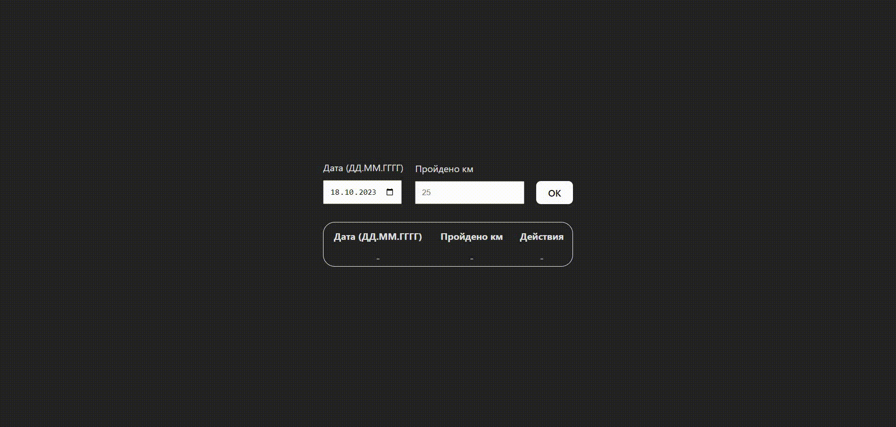

# training-records
### Ссылка на прототип:

https://vobiryukov12.github.io/training-records/

## Preview

## Описание
Мини-приложение на React, которое хранит данные о тренировках и прогулках.

### Возможности приложения:
- Новые значения добавляются не в конец, а согласно сортировке по дате
- Если добавляются значения, указывающие на уже существующую дату, то значения суммируются с теми, что хранятся в таблице
- С помощью иконки ✘ можно удалить строку. Удаляется вся строка целиком и данные, связанные с ней

### Особенности проекта:
- Все данные хранятся в localStorage
- Используется библиотека moment.js

### Технологии используемые на проекте:

